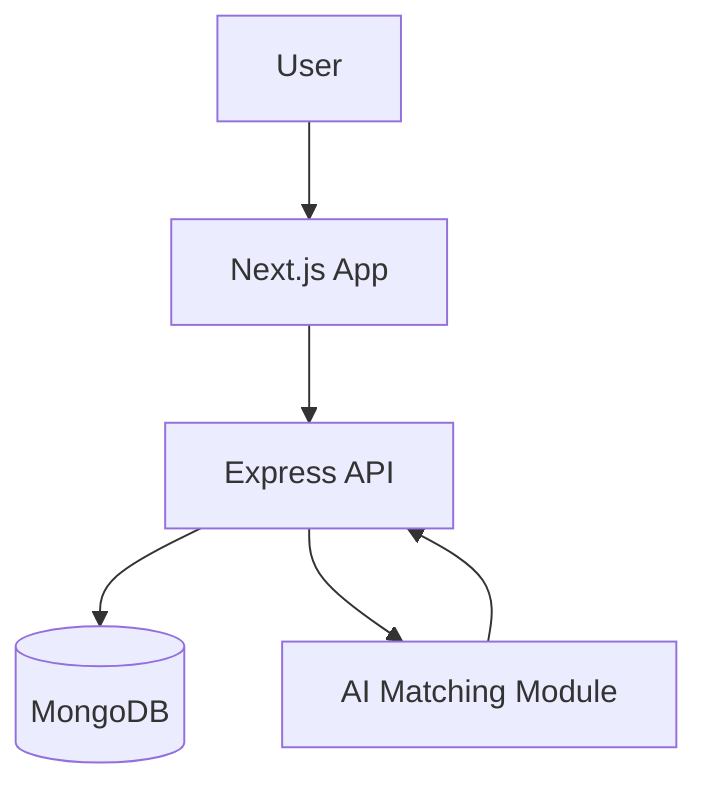

# 📘 SkillSync: AI-Powered Team Builder & Project Collaboration Platform

---

## 1. 📌 Project Overview

**SkillSync** is an AI-powered Team Builder and Project Collaboration Platform designed to help developers form efficient teams based on their unique skill sets and project requirements.

### 🎯 Core Idea

* **Create & Manage Projects**: Design your vision and define required roles.
* **AI-Powered Matching**: Our system intelligently suggests the best teammates based on skills.
* **People Directory**: Browse and connect with fellow builders in the network.
* **Seamless Collaboration**: Build and execute projects with the right team.

---

## 2. 🧱 Technology Stack

### 🔹 Frontend (Client)

* **Next.js** (React Framework)
* **TypeScript**
* **Tailwind CSS**
* **Lucide React** (Modern iconography)
* **Nex-Themes** (Dark/Light mode support)

### 🔹 Backend (Server)

* **Node.js + Express.js**
* **MongoDB (Mongoose ORM)**
* **JWT Authentication**

### 🔹 AI Integration

* Custom matching logic implemented in:
  * `aiController.js`

---

## 3. 🏗️ System Architecture

### 🔁 Overall Flow

---

## 4. 📂 Project Structure

### 🖥️ CLIENT (Frontend)

#### 📁 app/

* `page.tsx` → Landing page (SkillSync)
* `login/page.tsx` → Login
* `signup/page.tsx` → Signup
* `dashboard/page.tsx` → User dashboard (Project Feed)
* `people/page.tsx` → **[NEW]** Searchable directory of all users
* `create-project/page.tsx` → Project creation wizard
* `ai-match/page.tsx` → AI-driven team suggestions
* `profile/page.tsx` → User profile management & Logout

#### 📁 components/

* `Navbar.tsx` → Global navigation with SkillSync branding
* `PeopleCard.tsx` → **[NEW]** Component for user profiles
* `ProjectCard.tsx` → Component for project listings
* `theme-provider.tsx` → Dark/Light mode management

---

### ⚙️ SERVER (Backend)

* `server.js` → Entry point & middleware configuration
* `config/db.js` → MongoDB connection logic
* `models/` → User and Project schemas
* `controllers/` → Business logic for Auth, Users, Projects, and AI
* `routes/` → API entry points for frontend communication

---

## 5. 🚀 Key Features

* **🤖 AI-Based Team Matching**: Intelligently compares project requirements with user skills.
* **👥 People Directory**: A dedicated space to find and connect with developers.
* **🎨 Modern 1-Bit Aesthetic**: A clean, monochrome design system tailored for builders.
* **🔐 Secure Authentication**: JWT-based session management with Logout capability.
* **📱 Responsive Search**: Filter projects and people by name, skill, or role instantly.
* **📂 Sample Dataset**: Comes with `users_dataset.json` containing 10 diverse test profiles.

---

## 6. 🛠️ Getting Started

1. **Clone the Repo**: `git clone <repo-url>`
2. **Setup Server**: 
   - `cd server`
   - `npm install`
   - Configure `.env` with `MONGO_URI` and `JWT_SECRET`
   - `npm start`
3. **Setup Client**:
   - `cd client`
   - `npm install`
   - `npm run dev`

---

## 7. 🎯 Conclusion

**SkillSync** demonstrates a modern full-stack application that integrates AI-driven recommendations to enhance collaboration. It provides a scalable, intelligent, and user-friendly platform for building effective teams and managing projects efficiently.

---
